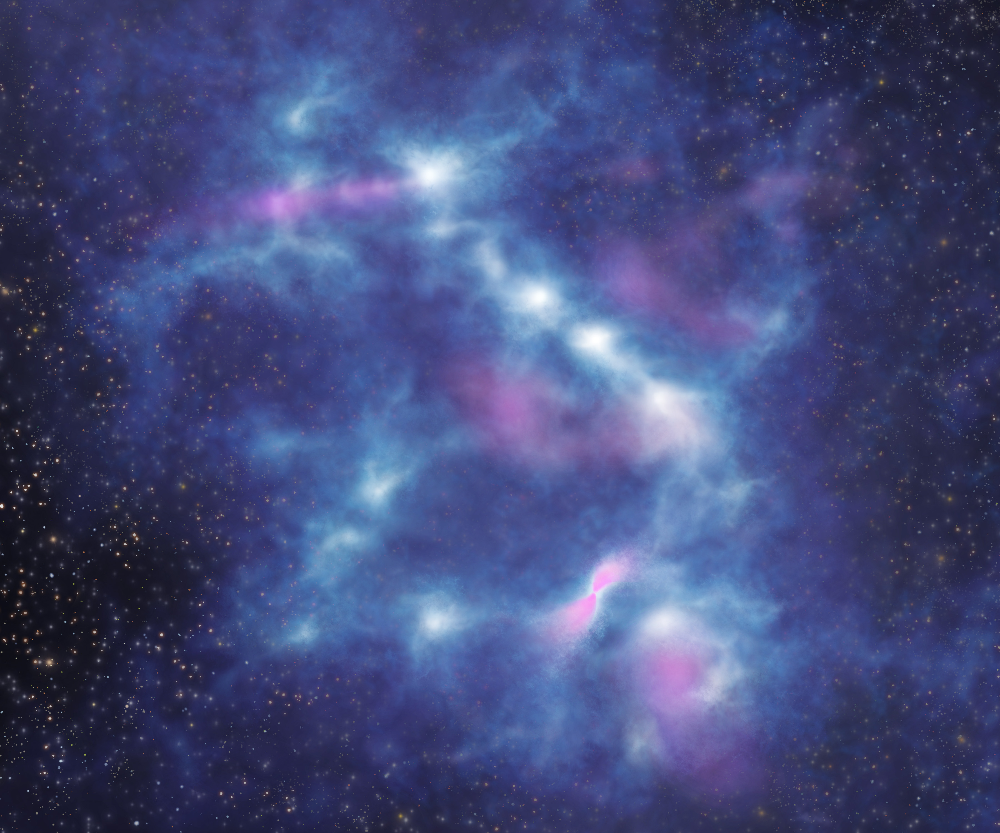
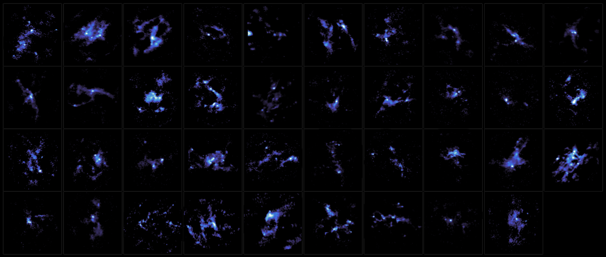

    
Our latest research findings have been released as a press release.  
NAOJ: [https://www.nao.ac.jp/en/news/science/2023/20230620-alma.html](https://www.nao.ac.jp/en/news/science/2023/20230620-alma.html)  
ALMA[https://www.nao.ac.jp/en/news/science/2023/20230620-alma.html](https://www.nao.ac.jp/en/news/science/2023/20230620-alma.html)  

<h3>Observations of High-Mass Star Seeds Defy Models</h3> 
We have mapped 39 interstellar clouds where high-mass stars (stars with masses eight times more than the Sun)  are expected to form. This large sample allows us to shed light on a difficult-to-explore area of astrophysics, offering valuable insights into the initial phases of high-mass star and cluster formation. We investigated the mass, density, and distribution of these stellar seeds within clouds, which shows that the accepted model of low-mass star formation needs to be expanded to explain the formation of high-mass stars.  

Figure 1: An artist’s view on the internal structure of an infrared dark cloud revealed by  ALMA. The raw material for star formation consists of gas and dust. Here, the densest regions are represented in white and lower densities in blue-ish colors. Some protostars just formed eject gas in outflows, represented by the pink color.  Credit: ALMA (ESO/NAOJ/NRAO), K. Morii et al.

Figure 2: Dust emission maps for 39 IRDCs where massive stars are expected to form in the future. Credit: ALMA (ESO/NAOJ/NRAO), K. Morii et al. 
 

These results appeared as Kaho Morii et al. “The ALMA Survey of 70μm Dark High-mass Clumps in Early Stages (ASHES). IX. Physical Properties and Spatial Distribution of Cores in IRDCs” in The Astrophysical Journal on June 20, 2023. (doi: 10.3847/1538-4357/acccea)  
     
<h3>Other Articles</h3>
* ASHES to ASHES, Dust to… Star Formation? [AAS NOVA](https://aasnova.org/2021/11/16/ashes-to-ashes-dust-to-star-formation) / [astrobites](https://astrobites.org/2021/10/20/ashes-to-ashes-dust-to-starformation/)  
* Massive Young Stars Early in Formation 
[Center for Astrophysics|Harvard & Smithonian](https://www.cfa.harvard.edu/news/massive-young-stars-early-formation)
